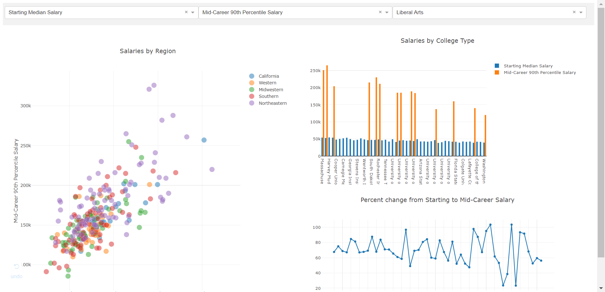
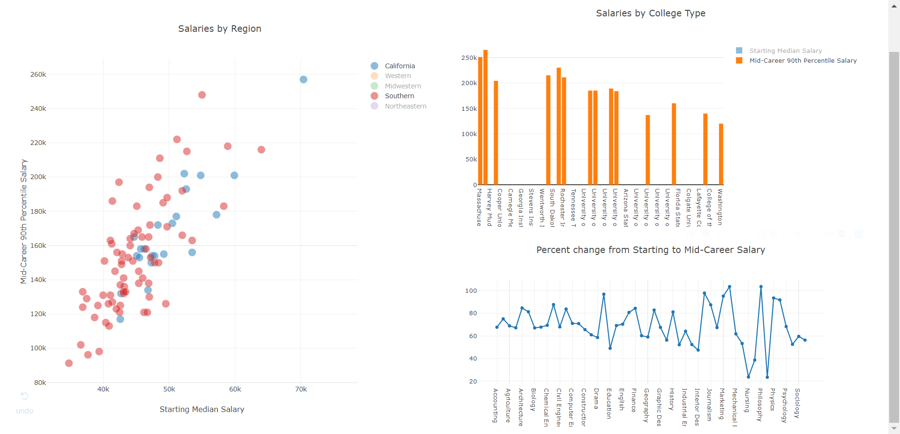

## How to run
First run the programme *lab3.py*. Click on the website showing on console. You will see a html page as below: 

- You can choose different period of career stage for the scatter plot and the bar figure at the first two labels. You can also choose the different type of college for the bar figure at the third label.

- You can also click the tag to make certain data invisible

